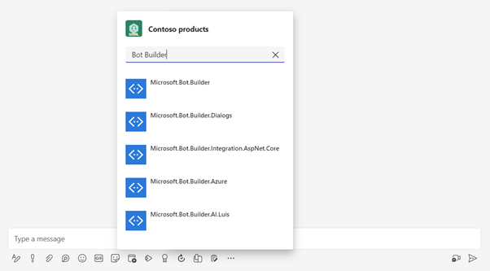
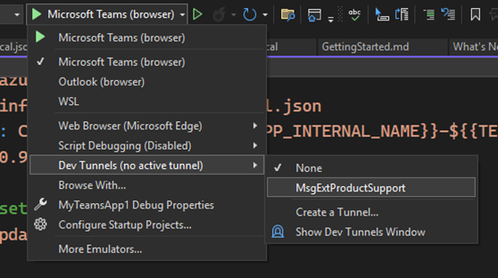
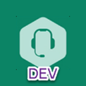
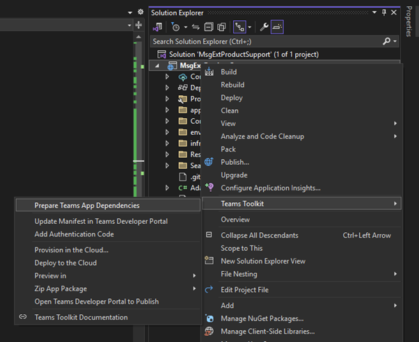

---
lab:
    title: 'Exercise 1 - Create a message extension'
    module: 'LAB 03: Connect Copilot for Microsoft 365 to your external data in real-time with message extension plugins built with .NET and Visual Studio'
---

# Exercise 1 - Create a message extension

In this exercise, you create a message extension with a search command. You first scaffold a project using a Teams Toolkit project template, then update it to configure it use an Azure AI Bot Service resource for local development. You create a Dev Tunnel to enable communication between the bot service and your locally running web service. You then prepare your app to provision the required resources. Finally, you run and debug your message extension and test it in Microsoft Teams.



## Task 1 - Create a new project with Teams Toolkit for Visual Studio

Start by creating a new project.

1. Open **Visual Studio 2022**
1. Open the **File** menu and expand the **New** menu, select **New project**
1. In the Create a new project screen, expand the **All platforms** dropdown, then select **Microsoft Teams**. Select **Next** to continue.
1. In the Configure your new project screen. Specify the following values:
    1. **Project name**: MsgExtProductSupport
    1. **Location**: Choose the default location
    1. **Place solution and project in the same directory**: Checked
1. Scaffold the project by selecting **Create**
1. In the Create a new Teams application dialog, expand the **All app types** dropdown, then select **Message Extension**
1. In the list of templates, select **Custom Search Results**
1. Scaffold the app by selecting **Create**

## Task 2 - Configure Azure AI Bot Service

A bot service resource can be created in Azure as a resource, or via dev.botframework.com. By default, the Custom Search Results template registers a bot using dev.botframework.com. At this moment, registering the bot with dev.botframework.com isn't compatible with Copilot for Microsoft 365.

To support Copilot for Microsoft 365, update the project to provision an Azure AI Bot Service resource in Azure and to use it for local development.

First, let’s create an environment variable to centralize an internal name for the app that we can reuse across our files and use when provisioning resources.

In Visual Studio:

1. In the **env** folder, open **.env.local**
1. In the file, add the following code:

    ```text
    APP_INTERNAL_NAME=msgext-product-support
    ```

1. Save your changes

You use data binding expressions, for example `${{APP_INTERNAL_NAME}}`, which enables you to inject environment variable values into files when using Teams Toolkit to provision resources.

To provision an Azure AI Bot Service resource, a Microsoft Entra app registration is required. Create an app registration manifest file that Teams Toolkit uses to provision the app registration with.

Continuing in Visual Studio:

1. In the **infra** folder, create a new folder called **entra**
1. In the folder, create a file with the name **entra.bot.manifest.json**
1. In the file, add the following code:

    ```json
    {
      "id": "${{BOT_ENTRA_APP_OBJECT_ID}}",
      "appId": "${{BOT_ID}}",
      "name": "${{APP_INTERNAL_NAME}}-bot-${{TEAMSFX_ENV}}",
      "accessTokenAcceptedVersion": 2,
      "signInAudience": "AzureADMultipleOrgs",
      "optionalClaims": {
        "idToken": [],
        "accessToken": [
          {
            "name": "idtyp",
            "source": null,
            "essential": false,
            "additionalProperties": []
          }
        ],
        "saml2Token": []
      },
      "requiredResourceAccess": [],
      "oauth2Permissions": [],
      "preAuthorizedApplications": [],
      "identifierUris": [],
      "replyUrlsWithType": []
    }
    ```

1. Save your changes.

Teams Toolkit uses Bicep files to provision and configure resources in Azure. First, create a parameters file. The parameters file is used to pass environment variables into a Bicep template.

Continuing in Visual Studio:

1. In the **infra** folder, create a new file named **azure.parameters.local.json**
1. In the file, add the following code:

    ```json
    {
      "$schema": "https://schema.management.azure.com/schemas/2015-01-01/deploymentParameters.json#",
      "contentVersion": "1.0.0.0",
      "parameters": {
        "resourceBaseName": {
          "value": "bot-${{RESOURCE_SUFFIX}}-${{TEAMSFX_ENV}}"
        },
        "botEntraAppClientId": {
          "value": "${{BOT_ID}}"
        },
        "botDisplayName": {
          "value": "${{APP_DISPLAY_NAME}}"
        },
        "botAppDomain": {
          "value": "${{BOT_DOMAIN}}"
        }
      }
    }
    ```

1. Save your changes.

Now, create a Bicep file that is used with the parameters file.

1. In the **infra** folder, create a new file named **azure.local.bicep**
1. In the file, add the following code:

    ```bicep
    @maxLength(20)
    @minLength(4)
    @description('Used to generate names for all resources in this file')
    param resourceBaseName string
    
    @description('Required when create Azure Bot service')
    param botEntraAppClientId string
    @maxLength(42)
    param botDisplayName string
    param botAppDomain string
    
    module azureBotRegistration './botRegistration/azurebot.bicep' = {
      name: 'Azure-Bot-registration'
      params: {
        resourceBaseName: resourceBaseName
        botAadAppClientId: botEntraAppClientId
        botAppDomain: botAppDomain
        botDisplayName: botDisplayName
      }
    }
    ```

1. Save your changes.

The last step is to update the Teams Toolkit project file. Replace the steps that use Bot Framework actions to provision the bot Microsoft Entra app registration using the manifest file and the Azure AI Bot Service resource using the Bicep file.

Continuing in Visual Studio:

1. In the project root folder, open **teamsapp.local.yml**
1. In the file, find the step that uses the **botAadApp/create** action (line 18) and replace it with:

    ```yml
      - uses: aadApp/create
        with:
          name: ${{APP_INTERNAL_NAME}}-bot-${{TEAMSFX_ENV}}
          generateClientSecret: true
          signInAudience: AzureADMultipleOrgs
        writeToEnvironmentFile:
          clientId: BOT_ID
          clientSecret: SECRET_BOT_PASSWORD
          objectId: BOT_ENTRA_APP_OBJECT_ID
          tenantId: BOT_ENTRA_APP_TENANT_ID
          authority: BOT_ENTRA_APP_OAUTH_AUTHORITY
          authorityHost: BOT_ENTRA_APP_OAUTH_AUTHORITY_HOST
    
      - uses: aadApp/update
        with:
          manifestPath: "./infra/entra/entra.bot.manifest.json"
          outputFilePath : "./build/entra.bot.manifest.${{TEAMSFX_ENV}}.json"
    
      - uses: arm/deploy
        with:
          subscriptionId: ${{AZURE_SUBSCRIPTION_ID}}
          resourceGroupName: ${{AZURE_RESOURCE_GROUP_NAME}}
          templates:
            - path: ./infra/azure.local.bicep
              parameters: ./infra/azure.parameters.local.json
              deploymentName: Create-resources-for-${{APP_INTERNAL_NAME}}-${{TEAMSFX_ENV}}
          bicepCliVersion: v0.9.1
    ```

1. In the file, remove the step that uses the **botFramework/create** action (lines 54-63).
1. Save your changes.

The app registration is provisioned in two steps, first the **aadApp/create** action creates a new multitenant app registration with a client secret, writing its outputs to the **.env.local** file as environment variables. Then the **aadApp/update** action uses the **entra.bot.manifest.json** file to update the app registration.

The last step uses the **arm/deploy** action to provision the Azure AI Bot Service resource to the resource group using the **azure.parameters.local.json** file and **azure.local.bicep** file.

## Task 3 - Create a Dev tunnel

When the user interacts with your message extension, the Bot service sends requests to the web service. During development, your web service runs locally on your machine. To allow the Bot service to reach your web service, you need to expose it beyond your machine using a Dev tunnel.



Continuing in Visual Studio:

1. On the toolbar, expand the debug profile menu by selecting the drop down next to **Microsoft Teams (browser) button** or **Start Project**.
1. Expand the **Dev Tunnels (no active tunnel)** menu and select **Create a Tunnel…**
1. In the dialog, specify the following values:
    1. **Account**: Login with your Microsoft 365 user account.
    1. **Name**: MsgExtProductSupport
    1. **Tunnel Type**: Temporary
    1. **Access**: Public
1. Create the tunnel by selecting **OK** and in the resulting window, right-click on the tunnel and select **Make Active Tunnel** and you should see a checkmark next to the tunnel.
1. Close the prompt by selecting **OK**

## Task 4 - Update app manifest

The app manifest describes the features and capabilities of the app. Update properties in the app manifest to better describe the functionality of the app and its features.

First, download the app icons and add them to the project.




1. Download **color-local.png** and **color-dev.png**
1. In the **appPackage** folder, add **color-local.png** and **color-dev.png**
1. In the folder, delete the file named **color.png**

As the app name is replicated in different places in the project, create a new environment variable to store this value centrally.

Continuing in Visual Studio:

1. In the **env** folder, open the file named **.env.local**
1. In the file, add the following code:

    ```text
    APP_DISPLAY_NAME=Contoso products
    ```

1. Save your changes

Finally, update the icons, name, and description objects in the app manifest file.

1. In the **appPackage** folder, open the file named **manifest.json**
1. In the file, update the **icons**, **name**, and **description** objects with:

    ```json
        "icons": {
            "color": "color-${{TEAMSFX_ENV}}.png",
            "outline": "outline.png"
        },
        "name": {
            "short": "${{APP_DISPLAY_NAME}}",
            "full": "${{APP_DISPLAY_NAME}}"
        },
        "description": {
            "short": "Product look up tool.",
            "full": "Get real-time product information and share them in a conversation."
        },
    ```

1. Save your changes

## Task 6 - Provision resources

With everything now in place, using Teams Toolkit, run the Prepare Teams App Dependencies process to provision the required resources.



The Prepare Teams App Dependencies process updates the **BOT_ENDPOINT** and **BOT_DOMAIN** environment variables in .env.local file using the active Dev tunnel URL and execute the actions described in the **teamsapp.local.yml** file.

Continuing in Visual Studio:

1. In Solution Explorer, right-click the **MsgExtProductSupport** project
1. Expand the **Teams Toolkit** menu, select **Prepare Teams App Dependencies**
1. In the **Microsoft 365 account** dialog, select the account for your developer tenant, then select **Continue**
1. In the **Provision** dialog, select the account to use for deploying resources to Azure and specify the following values:
    1. **Subscription name**: Use the dropdown to select a subscription
    1. **Resource group**: Select New... to open a dialog, enter **rg-msgext-product-support-local, and select **OK**
    1. **Region**: Use the dropdown to select the region closest to you
1. Provision the resources in Azure by selecting **Provision**
1. In the Teams Toolkit warning prompt, select **Provision**
1. In the Teams Toolkit information prompt, select **View provisioned resources** to open a new browser window.

Take a moment to explore the resources created in Azure.

## Task 7 - Run and debug  

Now start the web service and test the message extension. You use Teams Toolkit to upload your app manifest and test your message extension in Microsoft Teams.

Continuing in Visual Studio:

1. Press F5 to start a debugging session and open a new browser window that navigates the Microsoft Teams web client.
1. When prompted, enter your Microsoft 365 account credentials

  > [!IMPORTANT]
  > If a dialog box appears in Microsoft Teams with the message, “This app cannot be found”, follow the below steps to upload the app package manually:
  >
  >  1. Close the dialog
  >  2. On the side bar, go to **Apps**
  >  3. On the left-hand menu, select **Manage your apps**
  >  4. In the command bar, select **Upload an app**
  >  5. In the dialog box, select **Upload a customized app**
  >  6. In the file explorer, navigate to the solution folder, open the **appPackage\build** folder and select **appPackage.local.zip**, then **Add**

Continue to install the app:

1. In the app install dialog, select **Add**
1. Open a new, or existing Microsoft Teams chat
1. In the message compose area, select **…** to open the app flyout
1. In the list of apps, select **Contoso products** to open the message extension
1. In the text box, enter **Bot Builder** to start a search
1. In the list of results, select a result to embed a card into the compose message box

Close the browser to stop the debugging session.

[Continue to the next exercise...](./3-exercise-add-single-sign-on.md)