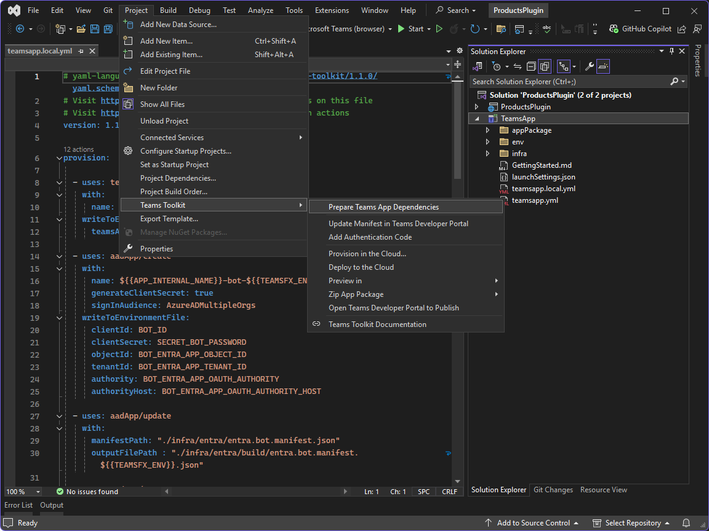

---
lab:
    title: 'Exercise 1 - Create a message extension'
    module: 'LAB 03: Connect Copilot for Microsoft 365 to your external data in real-time with message extension plugins built with .NET and Visual Studio'
---

# Exercise 1 - Create a message extension

In this exercise, you create a message extension solution. You use Teams Toolkit in Visual Studio to create the required resources, then start a debug session and test in Microsoft Teams.


## Task 1 - Create a new project with Teams Toolkit for Visual Studio

Start by creating a new Microsoft Teams app project configured with a message extension that contains a search command. While you could create a project using a Teams Toolkit for Visual Studio project template, there are changes required to be made to the scaffolded project to be able to complete this module. Instead, you use a custom project template that is available as a NuGet package. The benefit of using a custom template is that it creates a solution with the necessary files and dependencies, saving you time.

1. Open a new PowerShell session as Administrator.

1. Change to an appropriate working directory by running:

    ```Powershell
    cd ~\Documents
    ```

1. Start with installing the template package from NuGet by running:

    ```PowerShell
    dotnet new install M365Advocacy.Teams.Templates
    ```

1. Create a new project by running:

    ```PowerShell
    dotnet new teams-msgext-search --name "ProductsPlugin" `
      --internal-name "msgext-products" `
      --display-name "Contoso products" `
      --short-description "Product look up tool." `
      --full-description "Get real-time product information and share them in a conversation." `
      --command-id "Search" `
      --command-description "Find products by name" `
      --command-title "Products" `
      --parameter-name "ProductName" `
      --parameter-title "Product name" `
      --parameter-description "The name of the product as a keyword" `
      --allow-scripts Yes
    ```

1. Wait for the project to be created.

1. Change to the project directory by running `cd ProductsPlugin`.

1. Open the solution in Visual Studio by running `.\ProductsPlugin.sln`.

1. Select **Visual Studio 2022** from the application selection window and then select **Always**.

## Create a Dev tunnel

When the user interacts with your message extension, the Bot service sends requests to the web service. During development, your web service runs locally on your machine. To allow the Bot service to reach your web service, you need to expose it beyond your machine using a Dev tunnel.


Continuing in Visual Studio:

1. On the toolbar, select the drop-down next to **Start** button, expand the **Dev Tunnels (no active tunnel)** menu and select **Create a Tunnel**.

1. In the dialog, specify the following values:

    1. **Account**: Sign in using the Microsoft 365 account provided to you.

    1. **Name**: msgext-products

    1. **Tunnel Type**: Temporary

    1. **Access**: Public

1. Create the tunnel by selecting **OK**. A prompt is shown stating that the new tunnel is now the current active tunnel.

1. Close the prompt by selecting **OK**.

## Prepare resources

With everything now in place, using Teams Toolkit, run the **Prepare Teams App Dependencies** process to create the required resources.



The Prepare Teams App Dependencies process updates the **BOT_ENDPOINT** and **BOT_DOMAIN** environment variables in **TeamsApp\\env\\.env.local** file using the active Dev tunnel URL and executes the actions described in the **TeamsApp\\teamsapp.local.yml** file.

Take a moment to explore the steps in the **teamsapp.local.yml** file.

Continuing in Visual Studio:

1. Open the **Project** menu (alternatively, you can right select the **TeamsApp** project in the Solution Explorer), expand the **Teams Toolkit** menu and select **Prepare Teams App Dependencies**.

1. In the **Microsoft 365 account** dialog, sign in to or select an existing account to access your Microsoft 365 tenant, then select **Continue**.

1. In the **Provision** dialog, sign in or select an existing account to use for deploying resources to Azure and specify the following values:

      1. **Subscription name**: Use the dropdown to select a subscription.

      1. **Resource group**: Select the pre-populated resource group from the dropdown list.

1. Create the resources in Azure by selecting **Provision**.

1. In the Teams Toolkit warning prompt, select **Provision**.

1. In the Teams Toolkit information prompt, select **View provisioned resources** to open a new browser window.

Take a moment to explore the resources created in Azure and also view the environment variables created in the **.env.local** file.

> [!NOTE]
> When you close and reopen Visual Studio, the Dev tunnel URL will change and will no longer be selected as the active tunnel. If this happens you will need to select the tunnel again and run the **Prepare Teams App Dependencies** process to reflect the updated URL in the app manifest.

## Task 4 - Run and debug

Teams Toolkit uses multi-project launch profiles. To run the project, you need to enable a preview feature in Visual Studio.

In Visual Studio:

1. Open the **Tools** menu and select **Options...**

1. In the search box, enter **multi-project**.

1. Under **Environment**, select **Preview Features**.

1. Check the box next to **Enable Multi-Project Launch Profiles** and select **OK** to save your changes.

To start a debug session and install the app in Microsoft Teams:

1. Press <kbd>F5</kbd> or select **Start** from the toolbar.

1. Trust or approve any SSL certification warnings that pop up when launching the app for the first time.

1. Wait until a browser window opens and the app install dialog appears in the Microsoft Teams web client. If prompted, enter your Microsoft 365 account credentials.

1. In the app install dialog, select **Add**.

To test the message extension:

1. Open a new chat and begin typing **Contoso** into the **To** box, selecting **Contoso Product Support**.

    > [!NOTE]
    > It will not work if you chat with your own user account. It must be another user or group.

1. In the message compose area, type **/apps** to open the App picker.

1. In the list of apps, select **Contoso products** to open the message extension.

1. In the text box, enter **hello**.

1. Wait for the search results to appear.

1. In the list of results, select **hello** to embed a card into the compose message box.


Return to Visual Studio and select **Stop** from the toolbar or press <kbd>Shift</kbd> + <kbd>F5</kbd> to stop the debug session.

[Continue to the next exercise...](./3-exercise-add-single-sign-on.md)