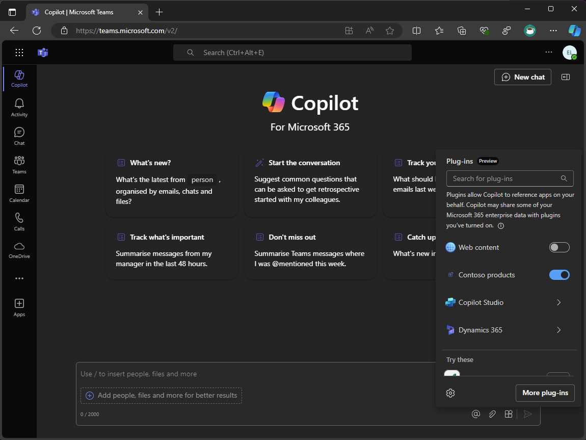
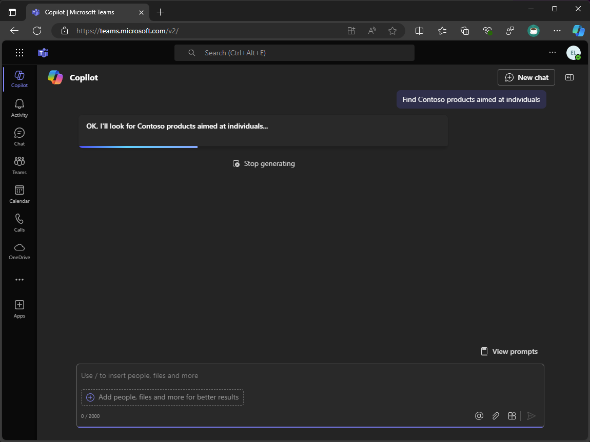
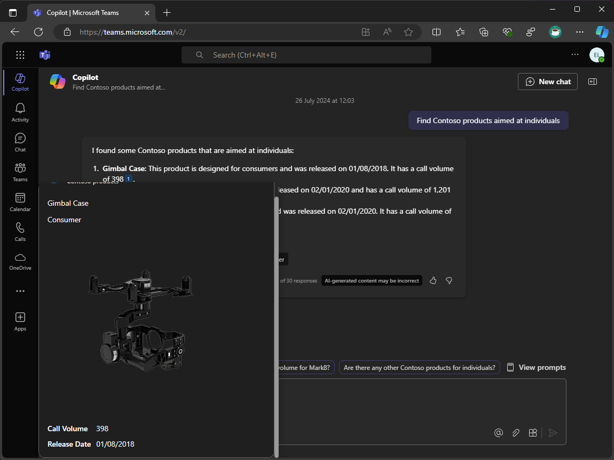

---
lab:
    title: 'Exercise 4 - Extend and optimize message extensions for use with Copilot for Microsoft 365'
    module: 'LAB 01: Connect Copilot for Microsoft 365 to your external data in real-time with message extension plugins built with .NET and Visual Studio'
---

# Exercise 4 - Extend and optimize message extensions for use with Copilot for Microsoft 365

In this exercise, you extend and optimize your message extension for use with Copilot for Microsoft 365. You add a new parameter called Target Audience and update the message extension logic to handle multiple parameters. Finally, you run and debug your message extension and test it in Copilot in Microsoft Teams.


## Task 1 - Update app description

Specifying concise and accurate descriptions in your app manifest is critical to ensuring Copilot knows when and how to invoke your plugin. Update the app, command, and parameter descriptions in the app manifest.

Open Visual Studio and in the **TeamsApp** project:

1. In the **appPackage** folder, open **manifest.json**.

1. Update the **description** object

    ```json
    {
        "description": {
            "short": "Product look up tool.",
            "full": "Get real-time product information and share them in a conversation. Search by product name or target audience. ${{APP_DISPLAY_NAME}} works with Microsoft 365 Chat. Find products at Contoso. Find Contoso products called mark8. Find Contoso products named mark8. Find Contoso products related to Mark8. Find Contoso products aimed at individuals. Find Contoso products aimed at businesses. Find Contoso products aimed at individuals with the name mark8. Find Contoso products aimed at businesses with the name mark8."
        },
    }
    ```

## Task 2 - Add a new parameter

Add a new parameter that Copilot can use. This new parameter helps users look up products using Copilot that is aimed at different audiences, such as individuals and businesses.

Continuing in Visual Studio and in **TeamsApp** project:

1. In the **parameters** array, add the **TargetAudience** parameter after the **ProductName** parameter:

    ```json
    {    
        "parameters": [
            {
                "name": "ProductName",
                "title": "Product name",
                "description": "The name of the product as a keyword",
                "inputType": "text"
            },
            {
                "name": "TargetAudience",
                "title": "Target audience",
                "description": "Audience that the product is aimed at. Consumer products are sold to individuals. Enterprise products are sold to businesses",
                "inputType": "text"
            }
        ]
    }
    ```

1. Save your changes.

The description of the **TargetAudience** parameter describes what it's and explains that the parameter should accept **Consumer** or **Enterprise** are allowed values.

Next, update the command description to include the new parameter.

1. In the **commands** array, update the **description** of the command:

    ```json
    {
        "commands": [
            {
                "id": "Search",
                "type": "query",
                "title": "Products",
                "description": "Find products by name or by target audience",
                "initialRun": true,
                "fetchTask": false,
                "context": [...],
                "parameters": [...]
            }
        ]
    }
    ```

## Task 3 - Update message extension logic

To support the new parameter, and support complex prompts, update the **OnTeamsMessagingExtensionQueryAsync** method in the Bot Activity Handler to handle multiple parameters.

First, update the **ProductService** class to retrieve products based on the name and audience parameters.

Continuing in Visual Studio in the **ProductPlugin** project:

1. In the **Services** folder, open **ProductsService.cs**.

1. In the file, create new methods called **GetProductsByCategoryAsync** and **GetProductsByNameAndCategoryAsync**:

    ```csharp
    internal async Task<Product[]> GetProductsByCategoryAsync(string category)
    {
        var response = await _httpClient.GetAsync($"{_baseUri}products?category={category}");
        response.EnsureSuccessStatusCode();
        var jsonString = await response.Content.ReadAsStringAsync();
        return System.Text.Json.JsonSerializer.Deserialize<Product[]>(jsonString);
    }

    internal async Task<Product[]> GetProductsByNameAndCategoryAsync(string name, string category)
    {
        var response = await _httpClient.GetAsync($"{_baseUri}?name={name}&category={category}");
        response.EnsureSuccessStatusCode();
        var jsonString = await response.Content.ReadAsStringAsync();
        return System.Text.Json.JsonSerializer.Deserialize<Product[]>(jsonString);
    }
    ```

1. Save your changes.

Next, add a new method to the **MessageExtensionHelper** class to retrieve products based on the name and audience parameters.

1. In the **Helpers** folder, open **MessageExtensionHelper.cs**.

1. In the file, create a new method called **RetrieveProducts** that retrieves products based on the name and audience parameters:

    ```csharp
    internal static async Task<IList<Product>> RetrieveProducts(string name, string audience, ProductsService productsService)
    {
        IList<Product> products;
    
        if (string.IsNullOrEmpty(name) && !string.IsNullOrEmpty(audience))
        {
            products = await productsService.GetProductsByCategoryAsync(audience);
        }
        else if (!string.IsNullOrEmpty(name) && string.IsNullOrEmpty(audience))
        {
            products = await productsService.GetProductsByNameAsync(name);
        }
        else if (!string.IsNullOrEmpty(name) && !string.IsNullOrEmpty(audience))
        {
            products = await productsService.GetProductsByNameAndCategoryAsync(name, audience);
        }
        else
        {
            products = [];
        }
    
        return products;
    }
    ```

1. Save your changes.

The **RetrieveProduct** method retrieves products based on the name and audience parameters. If the name parameter is empty and the audience parameter isn't empty, the method retrieves products based on the audience parameter. If the name parameter isn't empty and the audience parameter is empty, the method retrieves products based on the name parameter. If both the name and audience parameters aren't empty, the method retrieves products based on both parameters. If both parameters are empty, the method returns an empty list.

Next, update the **SearchApp** class to handle the new parameter.

1. In **Search** folder, open **SearchApp.cs**..

1. In the **OnTeamsMessagingExtensionQueryAsync** method, replace the following code:

    ```csharp
    var name = MessageExtensionHelpers.GetQueryParameterValueByName(query.Parameters, "ProductName");
    
    var productService = new ProductsService(tokenResponse.Token);
    var products = await productService.GetProductsByNameAsync(name);
    ```

    With:

    ```csharp
    var name = MessageExtensionHelpers.GetQueryParameterValueByName(query.Parameters, "ProductName");
    var audience = MessageExtensionHelpers.GetQueryParameterValueByName(query.Parameters, "TargetAudience");

    var productService = new ProductsService(tokenResponse.Token);
    var products = await MessageExtensionHelpers.RetrieveProducts(name, audience, productService);
    ```

1. Save your changes.

The **OnTeamsMessagingExtensionQueryAsync** method now retrieves the name and audience parameters from the query parameters. It then retrieves products based on the name and audience parameters using the **RetrieveProducts** method.

## Task 4 - Create and update resources

With everything now in place, run the **Prepare Teams App Dependencies** process to create new resources and update existing ones.

Continuing in Visual Studio:

1. In **Solution Explorer**, right-click the **TeamsApp** project.

1. Expand the **Teams Toolkit** menu, select **Prepare Teams App Dependencies**.

1. In the **Microsoft 365 account** dialog, select **Continue**.

1. In the **Provision** dialog, select **Provision**.

1. In the **Teams Toolkit warning** dialog, select **Provision**.

1. In the **Teams Toolkit information** dialog, select the cross icon to close the dialog.

## Task 5 - Run and debug

With the resources provisioned, start a debugging session to test the message extension.

First, start **Dev Proxy** to simulate the custom API.

1. Open a new Terminal as Administrator.

1. Run the following command to start Dev Proxy:

   ```bash
   devproxy --config-file "~appFolder/presets/learn-copilot-me-plugin/products-api-config.json"
   ```

1. If prompted, accept the certificate warnings.

> [!NOTE]
> When Dev Proxy is running, it acts as a system-wide proxy.

Next, start a debug session in Visual Studio:

1. To start a new debug session, press <kbd>F5</kbd> or select **Start** from the toolbar.

1. Wait until a browser window opens and the app install dialog appears in the Microsoft Teams web client. If prompted, enter your Microsoft 365 account credentials.

1. In the app install dialog, select **Add**.

1. Open the **Copilot** app in Microsoft Teams.

1. In the compose message area, open the **Plugins** flyout.

1. In the list of plugins, toggle the **Contoso products** plugin to enable it.

    

1. Enter **Find Contoso products aimed at individuals** as your message and send it.

1. Wait for Copilot to respond:

    

1. In the Copilot response, data returned in the plugin response is displayed and the plugin is referenced in the response:

    

1. To view the Adaptive Card relevant to the result, hover over the references in the Copilot response:

    

Return to Visual Studio and select **Stop** from the toolbar, or press <kbd>Shift</kbd> + <kbd>F5</kbd> to stop the debug session. Also, shut down Dev Proxy using <kbd>Ctrl</kbd> + <kbd>C</kbd>.

[Continue to the lab summary...](./6-summary.md)