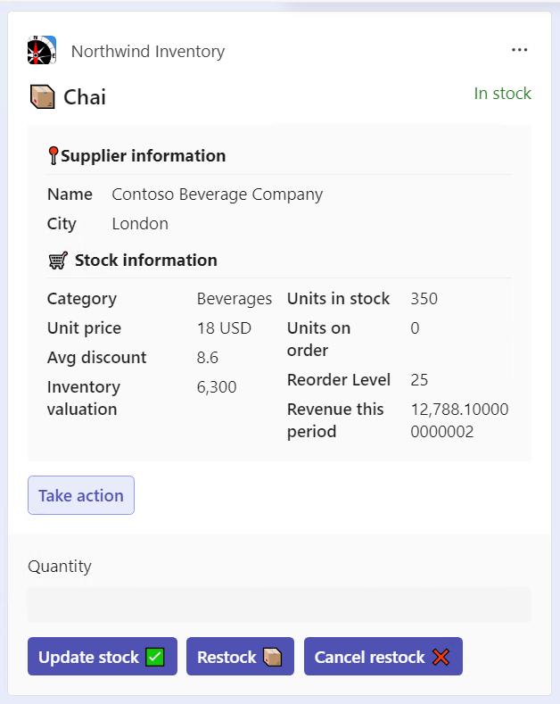

---
lab:
    title: 'Introduction'
    module: 'LAB 02: Build your own message extension plugin with TypeScript (TS) for Microsoft Copilot'
---

# Introduction

In this project, you'll learn to use Teams Message Extensions as plugins in Microsoft Copilot for Microsoft 365. The project is based on the "Northwind Inventory" sample contained in this same [GitHub repository](https://github.com/OfficeDev/Copilot-for-M365-Plugins-Samples/tree/main/samples/msgext-northwind-inventory-ts). By using the venerable [Northwind Database](https://learn.microsoft.com/dotnet/framework/data/adonet/sql/linq/downloading-sample-databases), you'll have plenty of simulated enterprise data to work with.

Northwind operates a specialty foods e-commerce business out of Spokane, Washington. In this lab, you'll be working with the Northwind Inventory application, which provides access to product inventory and financial information.

This exercise should take approximately **60** minutes to complete.

## Before you start

- [**Prepare**](./2-prepare-development-environment.md) first by setting up your development environment and getting the application running.

- In [**Exercise 1**](./3-exercise-1-run-message-extension.md), you'll run the same application as a [message extension](https://learn.microsoft.com/microsoftteams/platform/messaging-extensions/what-are-messaging-extensions) in Microsoft Teams and Outlook.

- In [**Exercise 2**](./4-exercise-2-run-copilot-plugin.md), you'll run the application as a plugin for Copilot for Microsoft 365. You'll experiment with various prompts and you'll observe how the plugin gets invoked using different parameters. As you chat with Copilot, you can watch the developer console to see queries it's making.

- In [**Exercise 3**](./5-exercise-3-add-new-command.md), you'll learn how to add a new command to the application, so that you can expand the plugin capabilities and perform more tasks.

  

- Finally, [**in Exercise 4**](./6-exercise-4-explore-plugin-source-code.md) you'll go on a tour of the code to see how it works in more depth. If you don't yet have Copilot, everything else will still work as a message extension for Microsoft 365.

When you're ready to begin, [continue to the next exercise...](./2-prepare-development-environment.md)