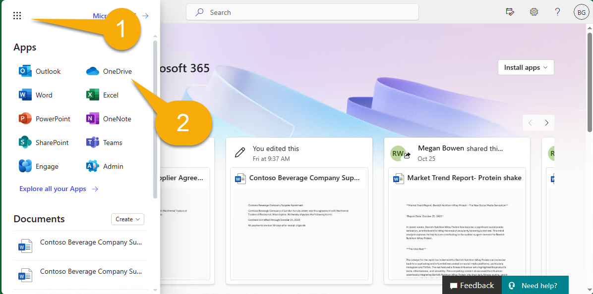
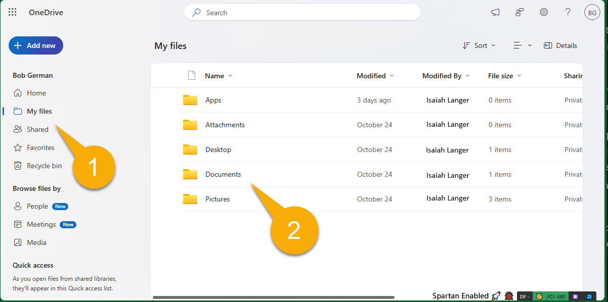
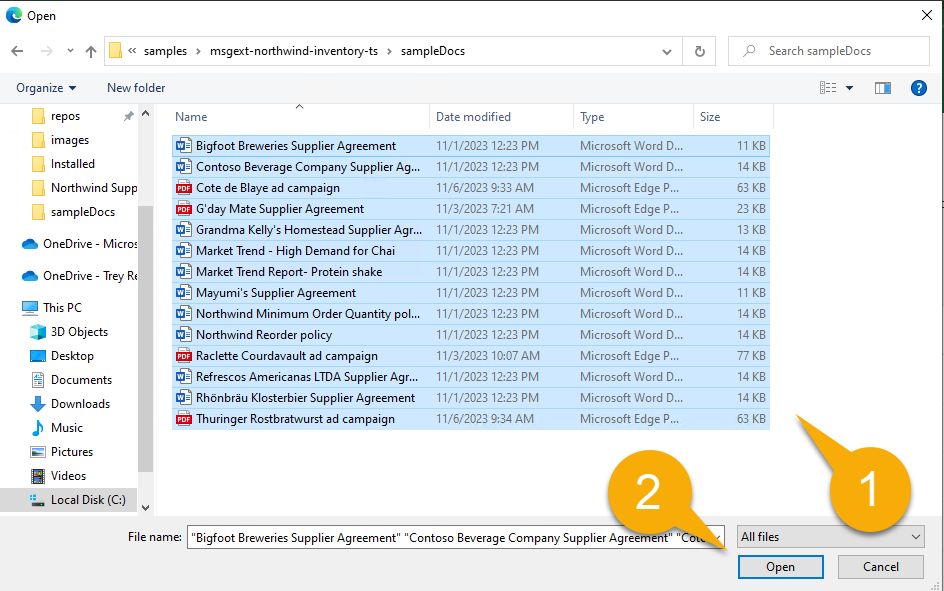
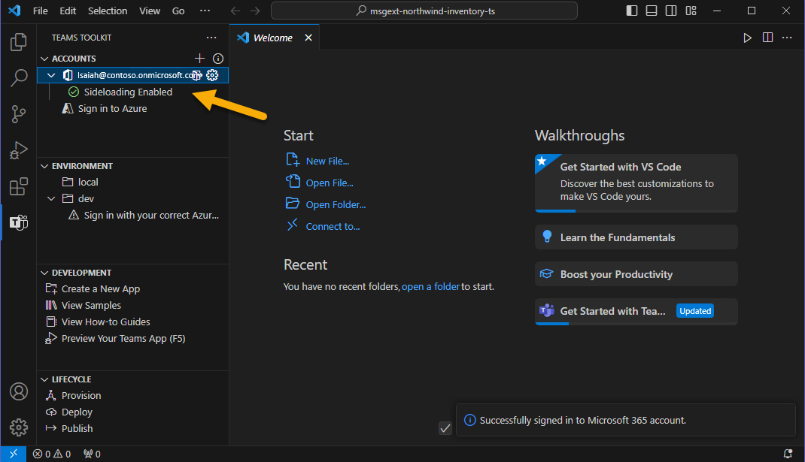

---
lab:
    title: 'Prepare your development environment'
    module: 'LAB 03: Build your own message extension plugin with TypeScript (TS) for Microsoft Copilot'
---

# Prepare your development environment

First off, let's prepare your development environment, accounts, and software. Before you can begin, you must complete the following tasks.

## Task 1 - Install prerequisites

> [!IMPORTANT]
> To complete this project successfully, you will need a Microsoft 365 account with permission to upload applications. To complete **Exercise 2**, the account must also be licensed for Microsoft Copilot for Microsoft 365.

If you are using a new tenant, it's a good idea to log into the [Microsoft 365 page](https://office.com) at [https://office.com](https://office.com) before beginning. Depending on how the tenant is configured, you may be asked to set up multifactor authentication. Ensure you can access Microsoft Teams and Microsoft Outlook before proceeding.

The following tools have already been installed in the lab on **MS-4010-DEVBOX**. Please make sure they are installed and operable:

1. [Visual Studio Code](https://code.visualstudio.com/) (latest version)

1. [Azure Storage Explorer](https://azure.microsoft.com/products/storage/storage-explorer/) - Download this if you want to view and edit the Northwind database used in this sample.

## Task 2 - Install nvm-windows

You'll use this tool to install Node.js and optionally switch Node versions as needed for your projects.

1. In a web browser, navigate to [https://github.com/coreybutler/nvm-windows/releases](https://github.com/coreybutler/nvm-windows/releases).
2. Locate the latest release version and select the **nvm-setup.zip** file to download.  The file will be downloaded to your machine.
3. Open the file folder and **extract** the contents of the zip folder to a folder on your machine.
4. From the new folder, select **nvm-setup.exe** to open the setup file.
5. Follow the prompts in the installer to install the tool using the default options.
6. Nvm for Windows will be installed on your machine.

## Task 3 - Install Node.js

Install Node.js version 18.18.2, which is compatible with all of the solutions in this course.

1. Open the **Command Prompt** application.
2. Enter the command `nvm install 18.18` to install Node.js.
3. The nvm output should confirm that installation is complete.
4. Run the command `nvm use 18.18` to use this version of Node.js.
5. Run the command `node -v` to confirm that you have version 18.18.2 installed.

You have now installed and configured Node.js version 18.18.2

## Task 4 - Download the sample code

Please [clone](https://github.com/OfficeDev/Copilot-for-M365-Plugins-Samples.git) or [download](https://github.com/OfficeDev/Copilot-for-M365-Plugins-Samples.git) the sample repository: [https://github.com/OfficeDev/Copilot-for-M365-Plugins-Samples/](https://github.com/OfficeDev/Copilot-for-M365-Plugins-Samples/).

Within the cloned or downloaded repository, navigate to the **samples/msgext-northwind-inventory-ts** folder. These labs will refer to this as your "**working folder**" since this is where you'll be working.

## Task 3 - Copy sample documents to OneDrive

The sample application includes some documents for Copilot to reference during the labs. In this task you'll copy these files to your user's OneDrive so Copilot can find them. Depending on how the tenant is set up, you may be asked to set up multifactor authentication as part of this process.

1. Open your browser and browse to Microsoft 365 ([https://www.office.com/](https://www.office.com/)). Sign in using the Microsoft 365 account you'll be using throughout the lab. You may be asked to set up multifactor authentication.

1. Using the apps menu in the upper left corner of the page 1️⃣, navigate to the OneDrive application within Microsoft 365 2️⃣.

    

1. Within OneDrive, navigate to **My Files** 1️⃣. If there's a documents folder, navigate into that as well. If not, you can work directly within the **My Files** location.

    

1. Now select **Add new** 1️⃣ and **Folder** 2️⃣ to create a new folder.

    

1. Name the folder **Northwind contracts** and select **Create**.

    

1. Now, from within this new folder, select **Add new** 1️⃣ again but this time select **Files upload** 2️⃣.

    

1. Now browse to the **sampleDocs** folder within your **working folder**. Highlight all the files 1️⃣ and select **OK** 2️⃣  to upload them all.

    

By doing this task early, there's a good chance that the Microsoft 365 search engine will have discovered them by the time you're ready for them.

## Task 4 - Install and set up Teams Toolkit for Visual Studio Code

In this task, you'll install the current version of [Teams Toolkit for Visual Studio Code](https://learn.microsoft.com/microsoftteams/platform/toolkit/teams-toolkit-fundamentals?pivots=visual-studio-code-v5). The easiest way to do this is from right within Visual Studio Code.

> [!NOTE]
> Do not install the pre-release version as it hasn't been tested with this lab.

1. Open your **working folder** in Visual Studio Code. You may be asked to trust the authors of this folder; if so, please do.

1. In the left sidebar, select **Extensions** 1️⃣. Enter the word **teams** into the search box 2️⃣ and locate **Teams Toolkit** in the search results. Select **Install** 3️⃣.

    

1. Now select the **Teams Toolkit** icon in the left 1️⃣. If it offers options to create a new project, you're probably in the wrong folder. In the **Visual Studio Code file menu** select **Open Folder** and directly open the **msgext-northwind-inventory-ts** folder. You should see sections for Accounts, Environment, etc. as shown below.

1. Under **Accounts** select **Sign in to Microsoft 365** 2️⃣ and sign in with your Microsoft 365 account.

    

1. A browser window will open and offer to log into Microsoft 365. When it says **You are signed in now and close this page**, please do so.

1. Lastly, verify that a green checkmark appears next to **Sideloading enabled**. If it doesn't, that means that your user account doesn't have permission to upload Teams applications. This permission is "off" by default; here are [instructions for enabling users to upload custom apps](https://learn.microsoft.com/microsoftteams/teams-custom-app-policies-and-settings#allow-users-to-upload-custom-apps)

    

> [!NOTE]
> The Microsoft 365 Developer Program doesn't include Copilot for Microsoft 365 licenses. As such, if you decide to use a developer tenant, you will be able to test the sample only as a Message Extension.

## Check your work

After following all the tasks above, you should have the following installed and downloaded to your computer:

- [Visual Studio Code](https://code.visualstudio.com/) (latest version)

- [NodeJS version 18.x](https://nodejs.org/download/release/v18.18.2/)

- [Azure Storage Explorer](https://azure.microsoft.com/products/storage/storage-explorer/) (OPTIONAL)

- [Teams Toolkit for Visual Studio Code](https://learn.microsoft.com/microsoftteams/platform/toolkit/teams-toolkit-fundamentals?pivots=visual-studio-code-v5)

- Sample repository: [https://github.com/OfficeDev/Copilot-for-M365-Plugins-Samples/](https://github.com/OfficeDev/Copilot-for-M365-Plugins-Samples/)

If everything has been prepared correctly, you are now ready to run the sample application as a message extension. 

[Continue to the next exercise... ](./3-exercise-1-run-message-extension.md)