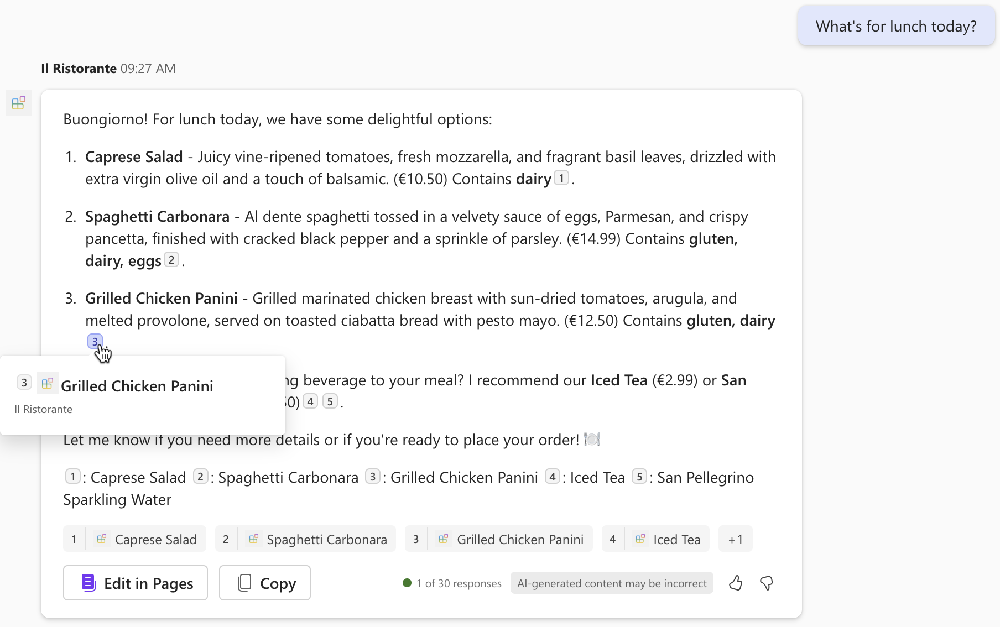

---
lab:
    title: 'Introduction'
    module: 'LAB 02: Build your first action for declarative agents with API plugin by using Visual Studio Code'
---

# Introduction

Microsoft 365 Copilot agents let you create AI-powered assistants optimized for specific scenarios. Using instructions, you define the context for the agent and specify settings such as tone of voice or how it should respond. By configuring the agent's skills, you give it the ability to interact with external systems, trigger certain behavior under system conditions, or use custom workflow logic. One type of skill is actions that allow a declarative agent to communicate with APIs both for retrieving and modifying data.

## Example scenario

Suppose you work in an organization, where you regularly order food from a local restaurant. The restaurant works with a daily menu which they publish on the Internet. You want to be able to quickly see what courses are available but also consider allergens in case you have guests. The restaurant exposes their menu via an API. Rather than building a separate app, you want to integrate the information into Microsoft 365 Copilot so that you can easily find the available dishes that you can order and find out their ingredients. You want to use natural language to browse through the menu and place orders.

## What will we be doing?

In this module, you build an action for a declarative agent with an API plugin. The action allows the agent to interact with an external system using its anonymous API. You learn to:

- **Create**: Create an API plugin that connects to an anonymous API.
- **Configure**: Configure the API plugin to show the data from the API.
- **Extend**: Extend a declarative agent with an action using an API plugin.
- **Provision**: Upload your declarative agent to Microsoft 365 Copilot and validate the results.

## Lab Duration

- **Estimated Time to complete**: 35 minutes

## Learning objectives

By the end of this module, you know how to integrate declarative agents with API plugins connected to anonymous APIs, to let them interact with external systems in real-time.